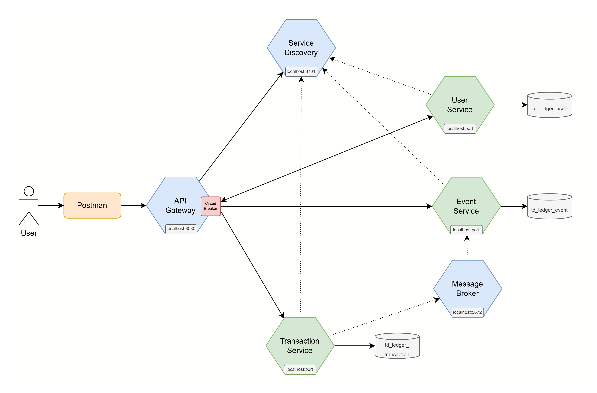
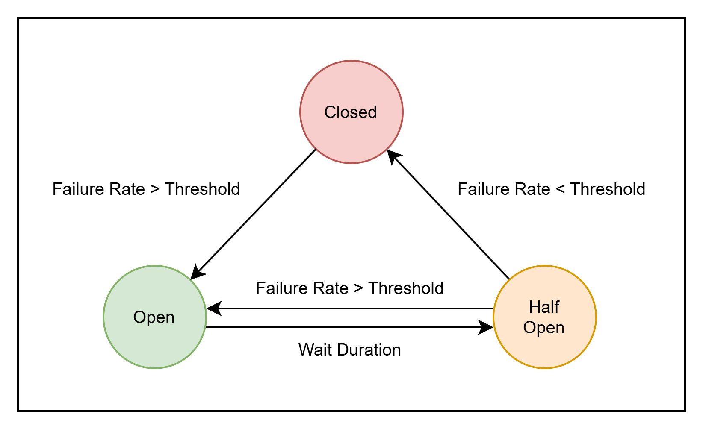
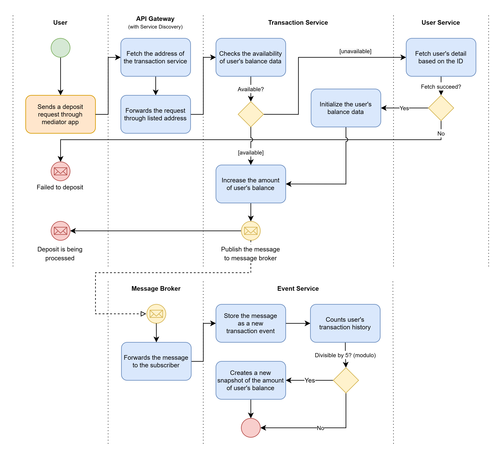
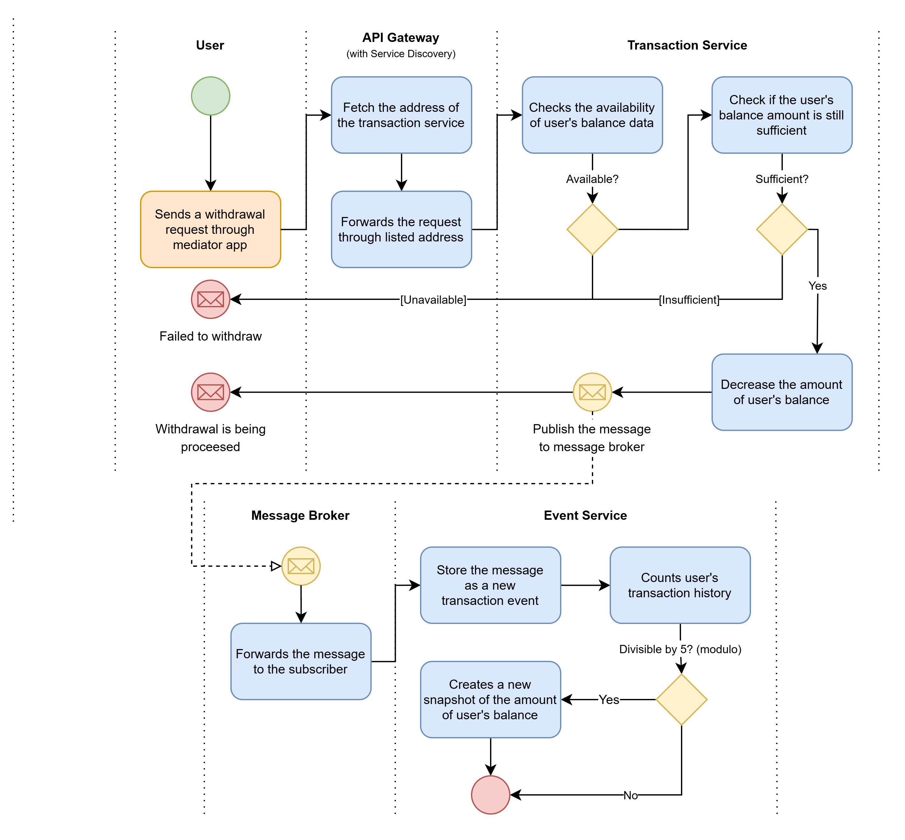

# Event Sourcing and Circuit Breaker
This is a sample project demonstrating the implementation of the [Event Sourcing](https://microservices.io/patterns/data/event-sourcing.html) and [Circuit Breaker](https://microservices.io/patterns/reliability/circuit-breaker.html) patterns in a microservices architecture.

### Patterns Review

**Event sourcing**
 This pattern is intended to handle data changes in the database (related to create/update/delete operations), which can cause issues when services exchange such data. As a solution, this pattern shifts the management concept to store only the records of the changes.

**Circuit Breaker**
 This pattern is designed to manage inter-service communication by temporarily disabling and re-enabling requests to a service during failures (works similarly to a circuit breaker in real-life).

### Case Study: Banking Ledger
- Recording all transactions as events (e.g., `DEPOSIT` | `WITHDRAWAL`)
- Querying the user's balance based on the recorded events
- Implementing a Circuit Breaker to protect services from being unresponsive.

## Prerequisites
- Java Development Kit 17
- PostgreSQL 16
- RabbitMQ 4
- Supporting Tools (e.g. Docker, WSL, IntelliJ IDEA, Postman)

## System Architecture Overview
To solve this case study, several microservices are initialized as shown in the diagram below.

### User Service
User service is used to handle user identity data, which consists of name, email, and address, and is connected to the `td_ledger_user` database.

| Method | Endpoint | Description
| --- | -------- | --- |
| POST |  `{url}`/user-service/users/register | Registers user identity to be recorded in the database |
| GET | `{url}`/user-service/users/`{id}` | Retrieves user information based on their ID (UUID) |
| GET | `{url}`/user-service/users?email=`{email}` | Retrieves user information based on email |
| GET | `{url}`/user-service/users/balance/`{id}` | Retrieves information about the user's balance, involving communication with the <u>event service</u> |

**Note:** `{url}` should be filled with the API Gateway's URL (This also applies to other services).

### Transaction Service
Transaction service is used to handle `WITHDRAW` and `DEPOSIT` by constructing payloads to be forwarded and recorded by the event service. This service includes the `td_ledger_transaction` database to store the account change history, consist of (balance) `id`, `user_id`, and `amount`. Even though its not directly related to Event Sourcing, it serves the purpose to check the availability and amount of user's balance.

| Method | Endpoint | Description |
| --- | --- | --- |
| POST | `{url}`/transaction-service/transactions/deposit | Increases the user's balance|
| POST | `{url}`/transaction-service/transactions/withdraw | Decreases the user's balance |

**Note:** Upon handling a deposit or withdrawal request, the transaction service will send a request for synchronous communication. However, it will publish the event to the message broker for asynchronous communication.

### Event Service
Event service is responsible for recording all changes as events, which each of them has a `type`, `payload`, and `timestamp`. In this case, the event types are defined as `DEPOSIT`, `WITHDRAW`, and `SNAPSHOT`. The `SNAPSHOT` stores the aggregate state of the user's balance every *N* events to enhance processing efficiency and cut down the need to retrieve the entire history of past events.

| Method | Endpoint | Description |
| --- | --- | --- |
| POST | `{url}`/event-service/events | Receives the incoming request and records it as an event |
| POST | `{url}`/event-service/events/currentBalance/`{userId}` | Returns the user's current balance. The operation involves calculating from the stored events and utilizing the most recent snapshot as the starting point for the search, if available. |

<b>Note:</b> The first endpoint is only used to store the event in synchronous communication. However, it will receive the event from the message broker for asynchronous communication. 

### Message Broker
Message broker acts as an intermediary for communication between microservices, connecting the transaction service and the event service for asynchronous messaging. There are several main concepts:
- **Channel:** A communication path between an application and a message broker. At least 2 channels should be used to communicate between two microservices, between the publisher to the broker, and the broker to the subscriber.
- **Queue:** The storage area where messages are kept before being processed by the consumer. In this case, transaction service sends messages to a message broker (stored in a queue), and then its being sent to event service.
- **Exchange:** A component in a message broker that receives messages and routes them to the appropriate queue based on predefined rules (such as the routing key).
- **Binding:** To connect the queue to the exchange, routing messages based on the routing key. This ensures messages from transaction service go to the right queue for event service to process.

### Service Discovery
Service discovery is used to enable dynamic detection and communication between services in a microservices architecture, eliminating the need for static configurations (hard-coded addresses during communication). It ensures that services can efficiently find and connect to each other, even as they scale or change.

### API Gateway
API gateway acts as a single entry point for all client requests and microservices, serving as a routing hub within the internal system infrastructure. It optimizes service communication by efficiently managing the routing of requests, especially when the load balancing mechanisms is implemented.

#### Circuit Breaker
In an API gateway, a circuit breaker is crucial for enhancing system resilience and stability by preventing cascading failures during service outages or slowdowns. For instance, if the user service encounters issues, the circuit breaker will block requests to that service, and so the API gateway does not forward any requests (immediately returning an error response). Once the user service recovers and becomes stable, requests are routed to that service again.

The circuit breaker operates in three states:

| State | Description |
| --- | --- |
| `CLOSED`| The default state where all requests flow normally, and no interruptions occur. This is the state when the service is healthy or has recovered from an issue.
| `OPEN` | This state blocks all requests to the service. It is triggered when failures exceed a predefined threshold, preventing further load on the failing service.
| `HALF_OPEN` | After a set timeout, the circuit enters this state to allow limited requests to test if the service has recovered. If the service responds successfully below the failure threshold, the circuit transitions to `CLOSED`. If failures persist, it returns to `OPEN`.

## System Flows
This section outlines the primary flows of this simple Banking Ledger App, specifically the deposit and withdrawal process. Supporting flows, such as user registration, retrieval of user details by ID or email, and user's balance checking, are <u>excluded</u> to maintain focus and brevity.

**Deposit Flow**
- The process starts when the user sends a deposit request through a mediator app (e.g., Postman), which is forwarded to an API gateway.
- API gateway then forwards the request to the transaction service based on the registered address in the service discovery.
- Transaction service processes the deposit:
  - If the user's balance data doesn't exist yet, it will call the user service to check for the user's data and initialize the balance.
  - Then, it adds the deposit amount to the user's balance.
- A message is then published to the message broker with the predefined queue and topic, containing the transaction type (deposit), deposit request data, balance, and timestamp.
- Message broker receives the message from the transaction service and forwards it to the event service.
- Event service processes the message, storing it as a deposit event.
  - This service then checks the user's transaction history, and every 5 transactions (modulo 5), it creates a new snapshot of the user's balance from the last snapshot to the current state.

**Withdrawal Flow**
- The process isn't much different, starts when the user sends a withdrawal request through a mediator app and then forwarded to the API gateway.
- API gateway forwards the request to the transaction service based on the registered address in the service discovery.
- Transaction service processes the withdrawal:
  - If the user's balance doesn’t exist or the balance is insufficient for the withdrawal, it returns an error.
  - Otherwise, it deducts the withdrawal amount from the user's balance.
- A message is published to the message broker with the predefined queue and topic, containing the transaction type (withdrawal), withdrawal request data, balance, and timestamp.
- Message broker receives the message from the transaction service and forwards it to the event service.
- Event service processes the message, storing it as a withdrawal event.
  - This service then checks the user's transaction history, and every 5 transactions (modulo 5), it creates a new snapshot of the user's balance from the last snapshot to the current state.

